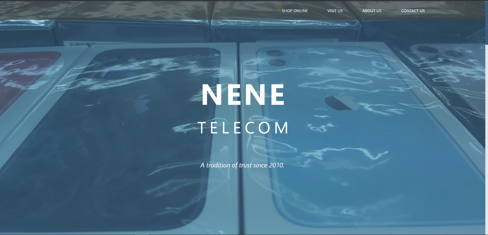
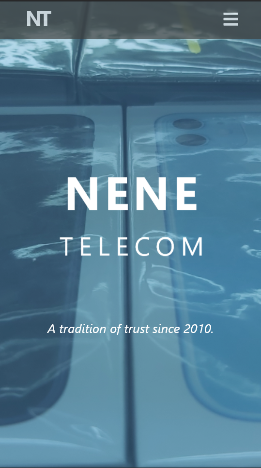
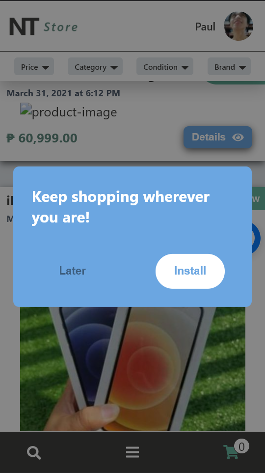
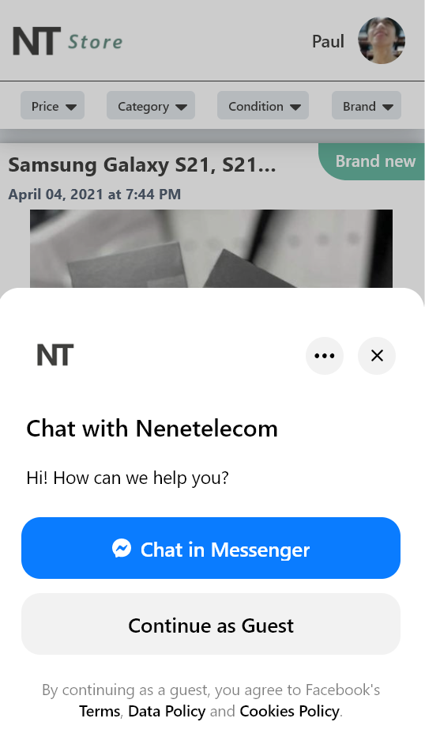
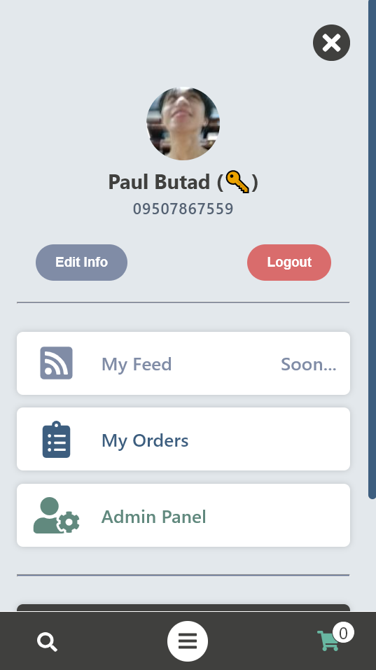
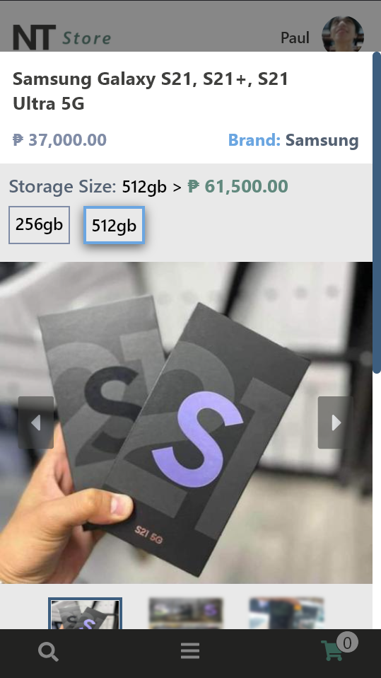
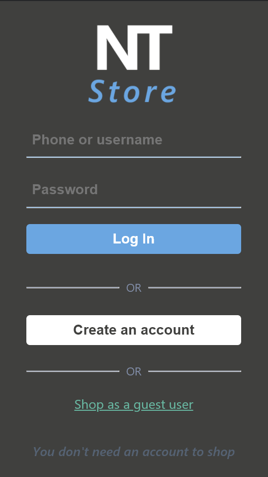
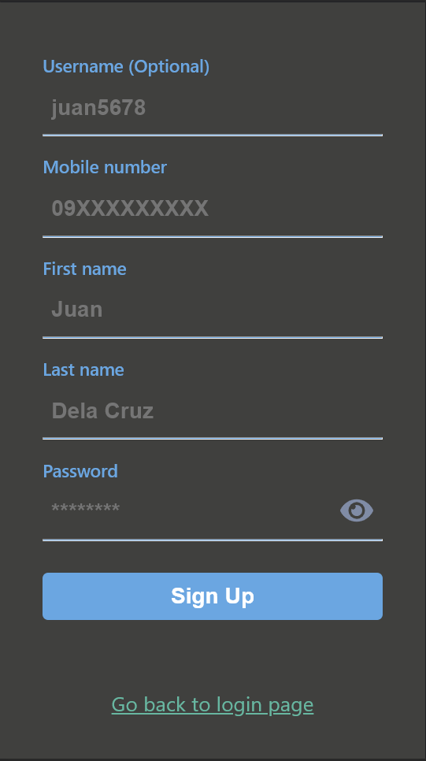

## _Before you run the project. Configure the following settings first_

#### 1. Export an environment settings by typing the command below in your terminal.

- For **development**:

  ```
  export DJANGO_SETTINGS_MODULE=nenetelecom.settings.development
  ```

- For **production**

  ```
  export DJANGO_SETTINGS_MODULE=nenetelecom.settings.production
  ```

- Or execute it from **bash script**

  ```
  bash selectenv.sh
  ```

===============================

#### 2. Create a .env file in the project directory and add the text below:

```
SECRET_KEY=PUT_YOUR_SECRET_KEY_HERE
```

===============================

#### 3. Install the needed python packages to run the project

1. Make sure you're in projects directory where you can see the "requirements.txt" file

2. Run the command below:

```
pip install -r requirements.txt
```

---

### _Key Features_:

<h4 align="center">Landing Page (Dekstop)</h4>


<h4 align="center">Landing Page (Mobile)</h4>
<p align="center">

</p>

<h4 align="center">Progressive Web App</h4>
<p align="center">

</p>

<h4 align="center">Messenger Plugin</h4>
<p align="center">

</p>

<h4 align="center">User type: Admin</h4>
<p align="center">

</p>

<h4 align="center">Product Variation</h4>
<p align="center">

</p>

<h4 align="center">Auth: Login Page</h4>
<p align="center">

</p>

<h4 align="center">Auth: Register Page</h4>
<p align="center">

</p>
